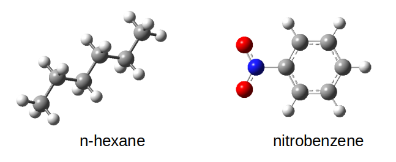

=================================================================================
Tutorial 1: Calculation of :math:`{\chi}_{ij}` for nitrobenzene/n-hexane solvents
=================================================================================

.. only:: html

    |Citing-CHIRIPA|

    .. |Citing-CHIRIPA| image:: https://img.shields.io/badge/cite-chiripa-orange
        :target: http://www.biophym.iem.csic.es

This tutorial consists of a full set of instructions that guide you in the calculation of 
the :math:`{\chi}_{ij}` for the pair nitrobenzene and hexane using CHIRIPA in a local server.
In this tutorial, the Okuwaki method [#]_ to generate :math:`{\chi}_{ij}` is followed.

In this context, local server means to make all calculations in the local machine.
The use of ``chiripa`` assumes you have some familiarity with the Python3 language. 
``chiripa`` is not guaranteed to work with Python 2 

**STEP 1: Definition and creation of the segments**

We need to construct proper structures for the molecules of interest. 
This should be the whole molecule in the case of small molecules  
or a group of repeat units in the case of polymers.

In this tutorial, the ``n-hexane_mp2.pdb`` and ``nitrobenzene_mp2.pdb`` are needed. 
The have been built and optimized using `Gaussian16 <https://www.gaussian.com>`_
(MP2/6-311G**). These files can be found in the directory ``chiripa/tutorials/00-data``.

**STEP 2: Writting the python script to launch the calculations**

A python script must be written to run the calculations. 
First, import the **chiripa** package:

.. code-block::

    import chiripa as chi

The `Chi_Universe <chi_universe.html>`_ object contains all elements that we need to perform a calculation. 
You must specify a `dictionary  <https://docs.python.org/3/tutorial/datastructures.html#dictionaries>` to create the `Chi_Universe <chi_universe.html>`_ object. This dictionary keeps the keywords that ``chiripa`` needs to run the calculation:

.. code-block::

    inputdict = { 'names'                 : ["n-hexane", "nitrobenzene"],
                  'filecoords'            : ["./n-hexane.pdb", "./nitrobenzene.pdb"],
                  'filetop'               : ["./n-hexane.pdb", "./nitrobenzene.pdb"],
                  'coordination_numbers_Z': True,
                  'Z_parameters'          : {'Z_samples'         : 50,
                                             'Z_puttrialmonomers': 100,
                                             'Z_debug'           : False,
                                             'Z_nonbonded'       : 'truhlar'},
                  'calculate_volume'      : True,
                  'interaction_energy'    : True,
                  'energy_parameters'     : {'qm_engine'            : "NwChem",
                                             'qm_path_exe'          : "/home/cfmac/jramos/CODES/NWCHEM/nwchem-6.6_cpu/bin/LINUX64/nwchem",
                                             'qm_charge'            : 0,
                                             'qm_multiplicity'      : 1,
                                             'qm_scratch_dir'       : '/scratch-local/',
                                             'qm_basisset'          : '6-31g**',
                                             'qm_method'            : 'm06-2x',
                                             'qm_task'              : 'energy',
                                             'number_configurations': 2,},
                   'server'                : {'name'         : "trueno.csic.es",
                                               'queue_system' : "slurm",
                                              'username'     : 'jramos',
                                              'key_file'     : '/home/jramos/.ssh/id_rsa_chiripa',
                                              'local_dir'    : '/home/jramos/PycharmProjects/chiripa/examples/EXAMPLE_16/',
                                              'remote_dir'   : '/home/cfmac/jramos/CHIRIPA/RUN_016/',
                                              'ncpus'        : 1,
                                              'nodelist'     : "trueno92,trueno93,trueno95"
                                             }
            }

.. warning::

    A full description of all keywords can be found in 

 

.. [#] Okuwaki, K.; Mochizuki, Y.; Doi, H.; Ozawa, T. Fragment Molecular Orbital Based Parametrization Procedure for Mesoscopic Structure Prediction of Polymeric Materials. J. Phys. Chem. B 2018, 122 (1), 338–347. https://doi.org/10.1021/acs.jpcb.7b08461
